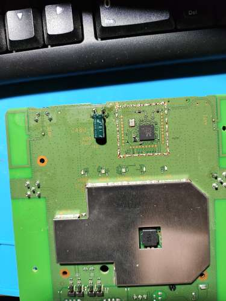

# olax_ax9_pro

Olax CPE AX9 PRO

OLAX AX9 PRO adalah router WiFi untuk jaringan 4G LTE / 3G, dirilis pada tahun 2022 untuk menggantikan model yang lebih terkenal dari pabrikan yang sama AX5 PRO, yang dihentikan produksinya. Model AX9 PRO baru memiliki fungsi dan karakteristik yang mirip dengan pendahulunya, namun memiliki beberapa ciri khas:
1. jumlah port LAN dikurangi dari 4 menjadi 2, namun kecepatan port LAN ditingkatkan dari 100 Mbit /s hingga 1000 Mbit/s (dalam versi putih tetap 100 Mbit/detik);
2. menambahkan port FXS (jack telepon RJ11) untuk menghubungkan telepon analog, termasuk. DECT, GAP, dll. dengan dukungan teknologi VoLTE (Voice over LTE) - panggilan suara di jaringan 4G;
3. menambahkan fungsi peralihan paksa dari antena 4G LTE/3G internal ke antena eksternal;
4. Kapasitas baterai meningkat dua kali lipat (jika dibandingkan dengan versi AX5 PRO B dengan baterai) - dari 2000 mAh menjadi 4000 mAh dan, karenanya, masa pakai baterai - dari 2-3 jam menjadi 4-5 jam. Pada versi putih, baterai menjadi pilihan.
 # 

## Spesifikasi

Modul/chipset utama: ASR1803@Cortex-A7
Jenis perangkat: router + titik akses
Standar WiFi: 802.11 b/g/n
Modul Wi-Fi: RTL8192ES
Rentang frekuensi perangkat Wi-Fi: 2,4 GHz
Dukungan bawaan untuk LTE Cat4
Bawaan dalam mendukung
Standar dan Band 3G:
4G LTE - B1/B3/B7/B8/B20/B28ab/B38/B40/B41
Frekuensi pengoperasian, MHz:
4G LTE - 700/800/900/1800/2100/2300/2500/2600
3G UMTS / DC-HSPA+ - 900/2100 MHz
SIM -
Kecepatan Port NANO, Mbit/s: 1000 (1 Gbit/s) atau 100 Mbit/s (untuk versi putih)
Jumlah port Ethernet: 2 (LAN, WAN/LAN)
Kecepatan MAX 4G LTE, Mbit/s: 150
Mendukung
metode enkripsi data MIMO WPA2
Mendukung IPv6
Firewall
DHCP server
DMZ
WPS
DNS dinamis mendukung
NAT
VPN
Antarmuka web
Jumlah port FXS (RJ11): 1
Kapasitas RAM, MB: 512
Kapasitas memori flash, MB: 512
Jumlah antena eksternal: 2
Jenis antena eksternal: dapat dilepas
Penguatan antena eksternal, dBi: 5
Lebar, mm: 144
Tinggi, mm: 144
Kedalaman, mm: 54
Berat, g: 400
Daya: 5 V, 2A
Baterai isi ulang (baterai): ya, 4000 mAh (hanya untuk versi hitam, untuk versi putih - opsional)
Jenis koneksi perangkat: nirkabel + kabel
Indikator - 5 (daya, standar jaringan, WiFi, LAN, tingkat penerimaan jaringan)
Ketersediaan konektor antena - ya, untuk 4G LTE/3G, SMA x 2 (MIMO)

# Firmware

- [AX9pro_B07.bin](firmware-origin/AX9pro_B07.bin)
- [AX9pro_B08.bin](firmware-origin/AX9pro_B08.bin)

# Informasi yang berguna

Standar untuk router OLAX modern adalah mengubah IMEI dan memperbaiki TTL langsung di menu.
Pembaruan firmware dengan mengklik tombol.
Akun root telah dihapus. Semuanya dapat diakses melalui admin.

Solusi masalah autostart (kapasitor)
Solusi masalah autostart (kapasitor dan dioda)

# Modif Autostart

Jika ada yang tertarik: lakukan autostart sendiri

Kapasitor elektrolit 10 uF/16 volt, negatif di sebelah kanan. Bekerja.
UPD: diganti dengan 0,47 uF, karena... Jika terjadi pemadaman listrik yang sangat singkat, tidak ada waktu untuk habis
dan modem tidak dapat dihidupkan. Akan lebih baik untuk menambahkan dioda ke catu daya, tetapi cara kerjanya seperti itu.

# modif autostart tanpa baterai

# Gambar

## Fix Koneksi wifi putus nyambung

